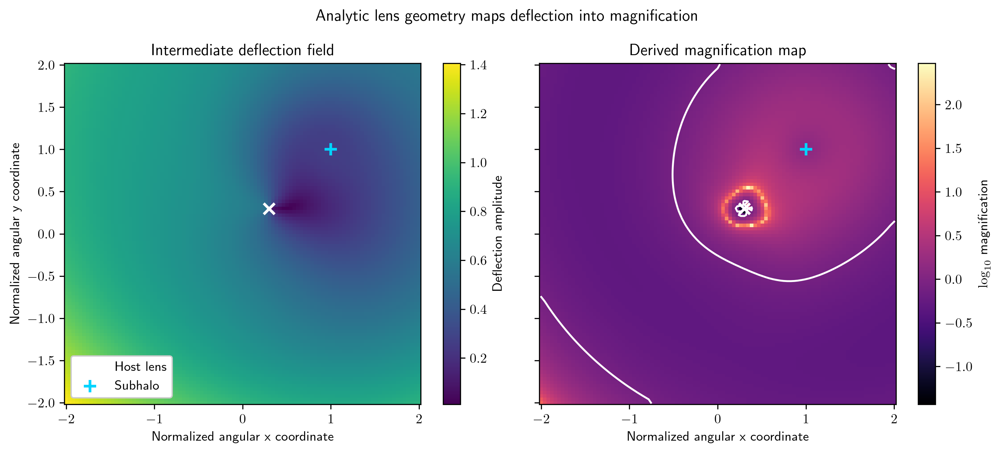

# Chalcedon

## Scientific purpose
Chalcedon is a gravitational-lensing simulation and modeling library. It provides the tooling needed to create and inspect lensing geometries, source configurations, and derived image-plane diagnostics.

## Scope
The repository is focused on lensing calculations and their visualization rather than on broader astronomical utility code. It fits in the ecosystem as a domain-specific simulation layer used by imaging and inference workflows that require physically interpretable lensing diagnostics.

## Installation

```bash
cd /path/to/chalcedon
python -m pip install -e .
export CHALCEDON_PATH=/path/to/chalcedon
```

`CHALCEDON_PATH` identifies the repository root. Keep runtime inputs in `data/` and generated pipeline outputs in `visuals/`; both directories are ignored by Git.

## Minimal usage

The runnable analytic example evaluates a host lens, one subhalo, and external shear on a normalized angular grid:

```bash
python examples/microlens_caustic.py --typefileplot png
```



The left panel exposes the intermediate deflection amplitude returned by `chalcedon.retr_caustics()`. The right panel shows the resulting magnification map and its contour candidates. Host and subhalo positions are marked explicitly. This is a deterministic lens-model prediction under the parameters encoded in the example, not an observed image.

## Output and diagnostics
A useful run should produce the input lensing configuration, relevant intermediate geometric quantities, and the final simulated or diagnostic image output in a reproducible and inspectable form.

## Development status
Chalcedon is maintained as a focused gravitational-lensing simulation library. It is not a generic astronomy toolbox and should remain structured around its specific lensing workflows and visual diagnostics.
